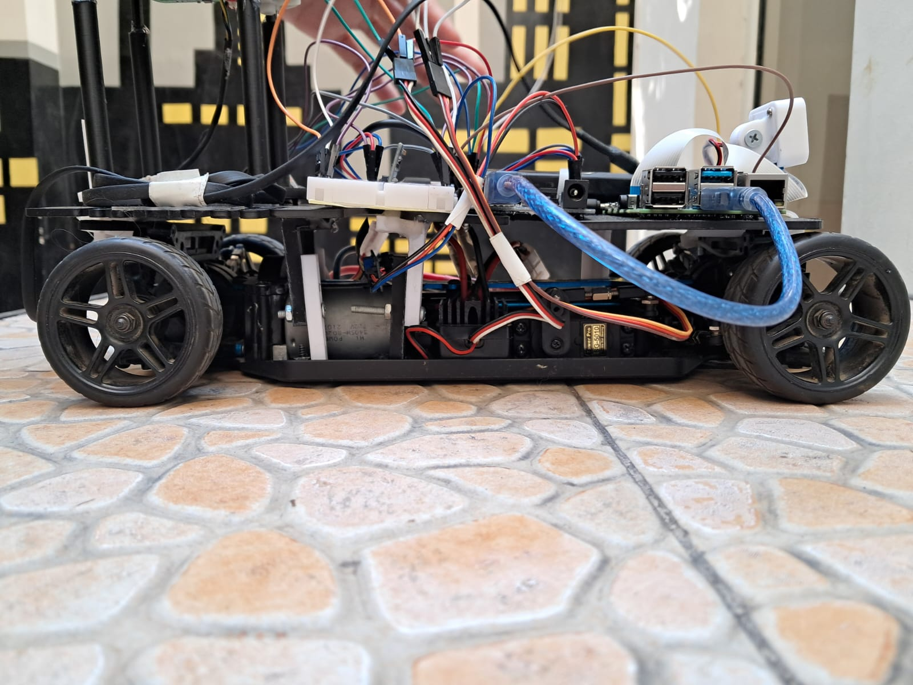
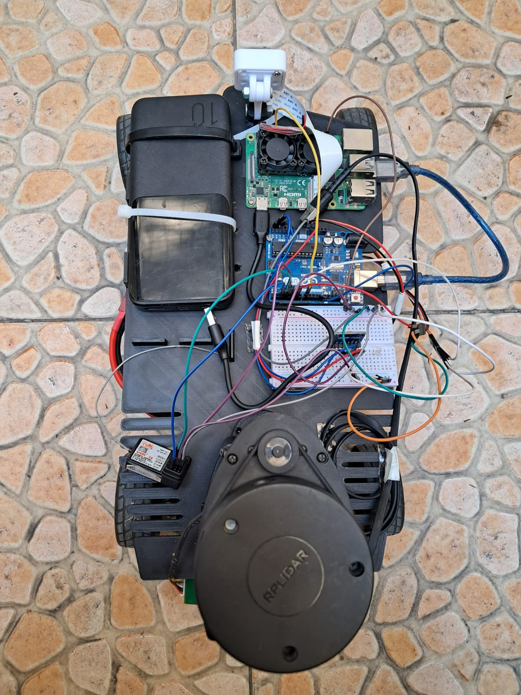
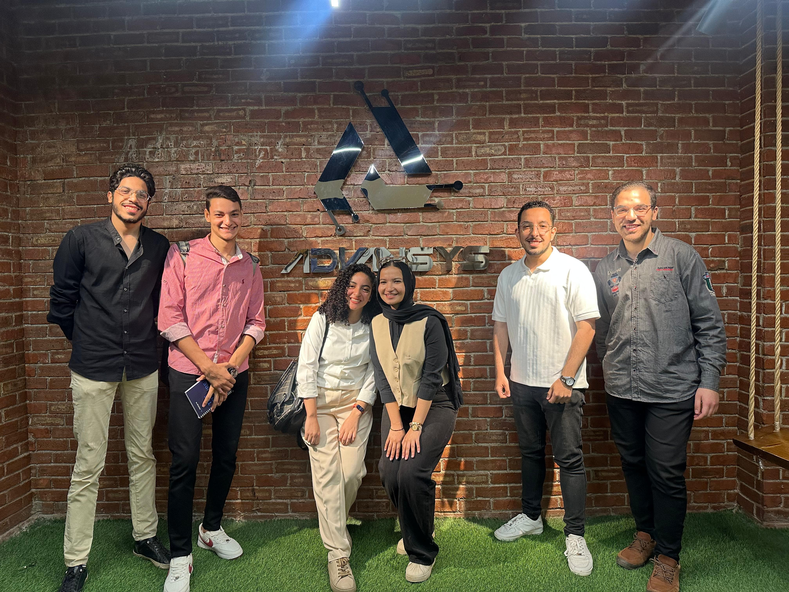

# Autonomous RC Car – Graduation Project (2025)

> A smart autonomous RC car that integrates LiDAR, camera, and IMU with AI-based perception, SLAM, obstacle avoidance, and closed-loop control using ROS 2. Built by the *Big Hero 6* team at Cairo University.

---
<p align="center">
  
</p>

## Project Overview

This project is centered around the development of an **Autonomous RC Car**. It harnesses cutting-edge technologies such as **LiDAR**, **camera**, and **IMU** to enable fully autonomous navigation.

By integrating these advanced sensors with robust software algorithms for **object detection**, **path planning**, and **real-time decision-making**, the car is capable of perceiving its environment, understanding complex road scenarios, and navigating safely.

The project incorporates:
- SLAM (Simultaneous Localization and Mapping)
- Dynamic obstacle avoidance
- Closed-loop control systems
- Simulation & testing in Gazebo + RViz

This ambitious project not only showcases modern robotics and autonomous driving, but also contributes methodologically to the field by improving on existing solutions.

---

## Objectives & Features

- **Autonomous Navigation:**  
  Navigate real-world roads and reach destinations without manual control.

- **Localization & Mapping:**  
  Map the environment using sensors, build accurate maps, and navigate through them in real-time.

- **Obstacle Avoidance:**  
  Detect and avoid static/dynamic obstacles using ROS and sensor data.

- **Object Detection:**  
  Recognize objects and traffic signs using camera input and deep learning models.

---

## Technologies Used

| Component           | Details                                                                 |
|---------------------|-------------------------------------------------------------------------|
| **Object Detection** | YOLOv5 – real-time vision-based object/traffic sign detection           |
| **SLAM**             | SLAM Toolbox in ROS 2 – for localization and mapping                    |
| **Path Planning**    | Algorithms like A* and Dijkstra's                                      |
| **Control**          | Closed-loop feedback for motor speed, steering, and heading correction |
| **Simulation**       | Gazebo + RViz2 for algorithm testing and visualization                  |
| **Middleware**       | ROS 2 (Foxy on Pi, Humble on laptop)                                    |

---

## Hardware Components

- Raspberry Pi 4 – Edge computer running ROS 2 Foxy  
- Arduino Uno – Low-level actuator control  
- RPLiDAR A1 – For 2D mapping and obstacle detection  
- Pi Camera v3 – For object detection  
- MPU6050 IMU – For orientation tracking  
- Brushed DC Motor + ESC – Drive system  
- 180° Servo Motor – Ackermann steering  
- Power Module – LiPo battery packs and regulators  

| Side View | Top View |
|----------------------|----------------------------|
|  |  |

---

## How to Run the Project

All files and instructions are organized inside the repository.

### Quick Start

1. Go to the `CheatSheets/` directory:
   - `Simulation.md`: Launch Gazebo + RViz2, run SLAM & Navigation

2. Navigate to `dev_ws/`:
   - Contains ROS 2 packages: URDF, navigation, perception, control, etc.

3. Explore `docs/`:
   - Setup guides, architecture overviews, and research notes

### Useful Commands

```bash
# for all Terminals 
ssh -X pi@192.168.198.161
# Password: 01145623392

# Launch simulation
ros2 launch race_it rsp.launch.py

# on dev_machine
rviz2

# Inside farah_ws (make sure to build and source)
# Launch on Raspberry Pi
ros2 launch race_it hardware_launch.py

# Launch laser scans (make sure rplidar is connected)
ros2 launch race_it rplidar.launch.py

# Launch odometry
ros2 launch rf2o_laser_odometry rf2o_laser_odometry.launch.py

# Teleop via keyboard
ros2 run teleop_twist_keyboard teleop_twist_keyboard

# SLAM
ros2 launch slam_toolbox online_async_launch.py slam_params_file:=./src/articubot_one/config/mapper_params_online_async.yaml use_sim_time:=false

# To save the map inside folder (maps) to use it again for navigation
ros2 run nav2_map_server map_saver_cli -f ~/farah_ws/src/race_it/maps/my_map

# For navigation
ros2 launch race_it nav2_bringup_launch.py

# Run object detection
vcgencmd get_camera
ros2 run v4l2_camera v4l2_camera_node

# Yolo
ros2 launch yolov5_ros2 yolov5_ros2_node.launch.py \
  sub_topic:='/image_raw' \
  weights:='yolov5s.pt'

cd ~/nasser_ws
source install/setup.bash
ros2 run stop_sign_gpio stop_sign_gpio_node

```

---

| Simulation in Gazebo | Object Detection in Action |
|----------------------|----------------------------|
|  |  |


---

## Meet the Team – Big Hero 6

We are a group of senior students from Faculty of Engineering, Cairo University – Electrical Power Department, passionate about robotics and intelligent systems.



### Team Members

- [Noureldeen Emad](https://www.linkedin.com/in/nourelboghdady/)  
- [Ahmed Nasser](https://www.linkedin.com/in/ahmed-nasser-42063b273/)
- [Eslam Gamal](https://www.linkedin.com/in/eslamgamal7/)
- [Farah Mahmoud](https://www.linkedin.com/in/farahmahmoud/)
- [Sama Khaled](https://www.linkedin.com/in/sama-khaled-6b549b275/)
- [Yahia Mohamed](https://www.linkedin.com/in/yehiasanusi/)

### Supervisors

- Dr. Mahmoud El-Naggar – Professor, Cairo University  
- Dr. Ahmed Lasheen – Assistant Professor, Cairo University  

Their guidance in control and autonomous systems has been essential to our project's success.

### Sponsor

- [Advansys](https://www.linkedin.com/company/advansys-esc/posts/?feedView=all) – For providing essential tools, mentorship, and technical support throughout the project

---

## Graduation Project Book

[Autonomous RC Car Graduation Project Book](https://drive.google.com/file/d/1HDqRIhTk7gE69-a77daM7_l8JCDMjveK/view?usp=sharing)

---

## License

This project is licensed under the MIT License – feel free to use, share, and build upon it.
